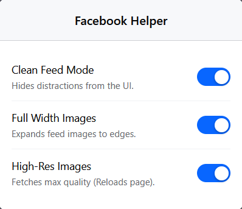

# Facebook Helper

This browser extension is built to have a better Facebook user experience.

[Demo Video](demo_video/facebook-helper-extension.mp4)

## Options

It provides 3 options

### Options

| Option                | Description |
|:----------------------| :--- |
| **Clean Feed Mode**   | Removes distractions from your feed by hiding the left and right sidebars.|
| **Full-Width Images** | Forces full-width images in your feed.|
| **High-Res Images**   | Forces high-quality images.|

## Note

- If you want to fork this repository and add your own better version, you can. I want this code to be used for further enhancement, but it must not be used for commercial purposes. Any level of fork of this code must always be free.
- License: [Attribution-NonCommercial-ShareAlike 4.0 International](https://creativecommons.org/licenses/by-nc-sa/4.0/)
